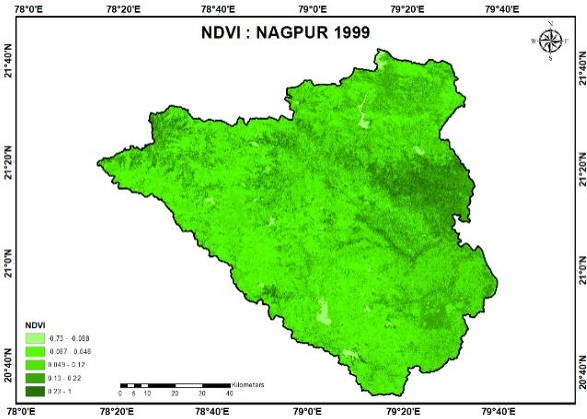
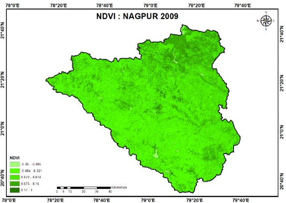
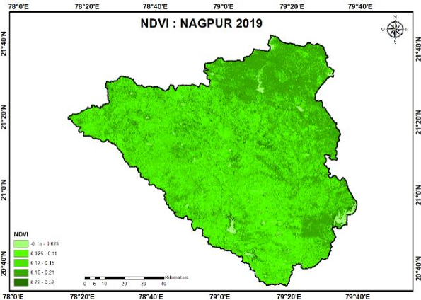
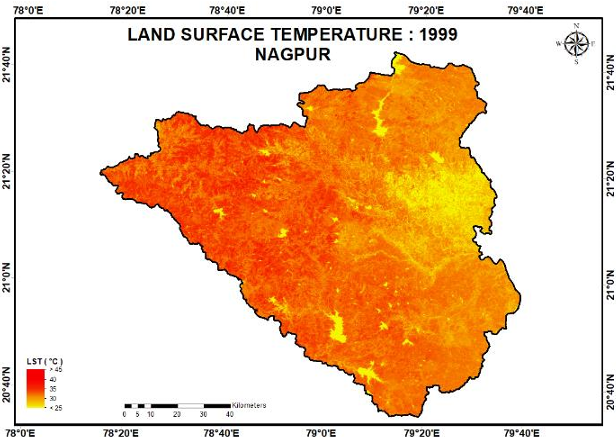
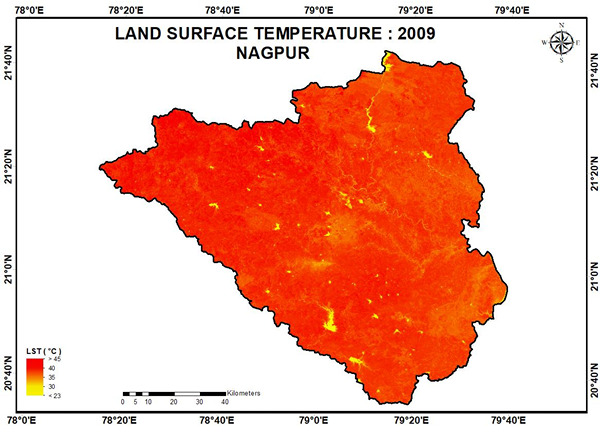
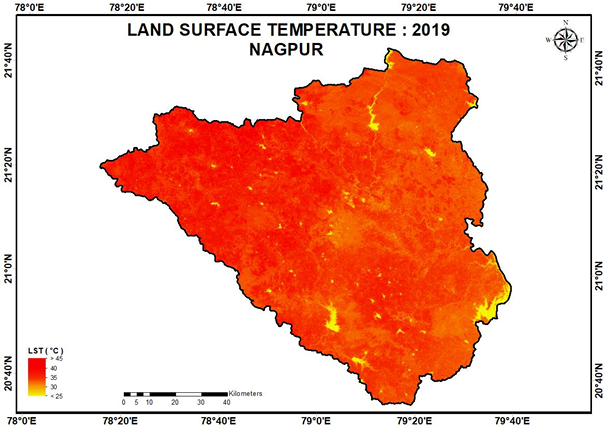
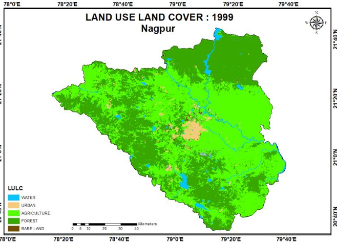
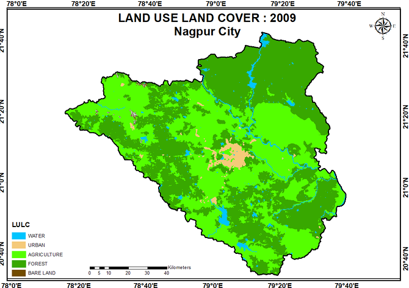
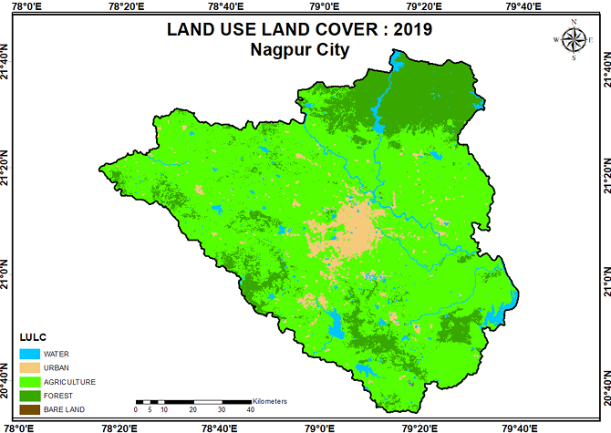

# Urbanization-Impact-LST
## A study on the impact of urbanization on Land Surface Temperature (LST) over two decades in Nagpur District, Maharashtra, using Remote Sensing and GIS technology.

## Table of Contents
- [Project Overview](#project-overview)
- [Objective](#objective)
- [Data and Methods](#Data-and-methods).
- [Area Of Interest](#area-of-interest).
- [Project Workflow](#Project-Workflow)
- [Thematic Layer](#thematic-layer)
- [Correlation between LST and NDVI](#Correlation-between-LST-and-NDVI)
- [Land Use Land Cover](#land-use-land-cover)
- [Results](#results)
- [Acknowledgments](#acknowledgments)
## Project Overview
Urbanization has significant environmental impacts, one of which is the increase in Land Surface Temperature (LST). This project focuses on analyzing the changes in LST in Nagpur district, Maharashtra, over the past two decades, using satellite imagery from Landsat 5 and Landsat 8, along with NDVI and LST indices. The analysis leverages Remote Sensing and GIS techniques to study the correlation between urban growth and temperature rise.

## Objective
The main objective of this project is to examine the impact of urbanization on LST in Nagpur district by:
 
Analyzing NDVI and LST values over time. 
Correlating vegetation changes with temperature variation. 
Mapping LST variations across urban and rural areas.

## Data and Methods
### Data Sources
Landsat 5 TM and Landsat 8 OLI/TIRS imagery for LST calculation.
Shapefiles and TIF files for spatial analysis.
### Methods Used
LST Calculation: Uses DN (Digital Numbers) to Radiance conversion and Brightness Temperature calculation.
NDVI Calculation: Utilizes Red and NIR bands to calculate vegetation index.
Regression Analysis: Compares LST values across different years.
GIS Mapping: Creates maps showing temperature variations.
## Area Of Interest

## Project Workflow

## Thematic Layer

## Correlation between LST and NDVI

## Land Use Land Cover

## Result
- The outputs include GeoTIFF maps of VCI, TCI, and VHI for the specified region. Below is an example interpretation:
- **VCI Map**: Darker colors indicate higher vegetation stress.
- **TCI Map**: Higher TCI values correspond to lower temperature stress.
- **VHI Map**: Combines VCI and TCI, with lower values indicating more severe drought conditions.

### Sample Output:

## Acknowledgments
- **Google Earth Engine**: For the platform and data access.
- **Geemap Library**: For enabling visualization of results on interactive maps.
- **Landsat Data**: Courtesy of the United States Geological Survey (USGS).

