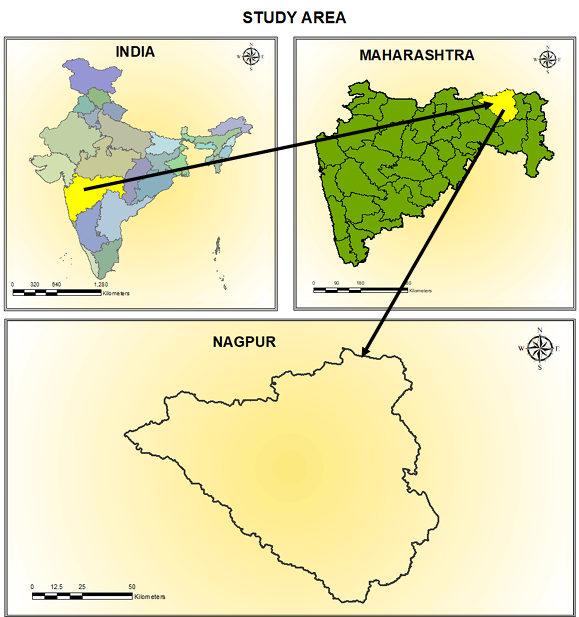
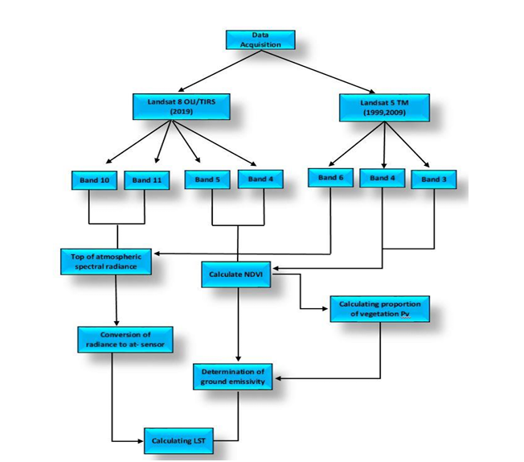

# Urbanization-Impact-LST
## A study on the impact of urbanization on Land Surface Temperature (LST) over two decades in Nagpur District, Maharashtra, using Remote Sensing and GIS technology.

## Table of Contents
- [Project Overview](#project-overview)
- [Objective](#objective)
- [Data and Methods](#Data-and-methods).
- [Area Of Interest](#area-of-interest).
- [Project Workflow](#Project-Workflow)
- [Technologies Used](#technologies-used)
- [Data Description](#data-description)
- [Methodology](#methodology)
- [Results](#results)
- [Acknowledgments](#acknowledgments)
## Project Overview
Urbanization has significant environmental impacts, one of which is the increase in Land Surface Temperature (LST). This project focuses on analyzing the changes in LST in Nagpur district, Maharashtra, over the past two decades, using satellite imagery from Landsat 5 and Landsat 8, along with NDVI and LST indices. The analysis leverages Remote Sensing and GIS techniques to study the correlation between urban growth and temperature rise.

## Objective
The main objective of this project is to examine the impact of urbanization on LST in Nagpur district by:
 
Analyzing NDVI and LST values over time. 
Correlating vegetation changes with temperature variation. 
Mapping LST variations across urban and rural areas.

## Data and Methods
### Data Sources
Landsat 5 TM and Landsat 8 OLI/TIRS imagery for LST calculation.
Shapefiles and TIF files for spatial analysis.
### Methods Used
LST Calculation: Uses DN (Digital Numbers) to Radiance conversion and Brightness Temperature calculation.
NDVI Calculation: Utilizes Red and NIR bands to calculate vegetation index.
Regression Analysis: Compares LST values across different years.
GIS Mapping: Creates maps showing temperature variations.
## Area Of Interest

## Project Workflow

## Technologies Used
- **Google Earth Engine**: For satellite data processing and geospatial analysis.
- **Geemap**: Python package to interact with Google Earth Engine and visualize map outputs.
- **Python**: Core programming language used for data processing and model computation.
- **Landsat 8**: Source of high-resolution spectral data for vegetation and temperature analysis.

## Data Description
This project relies on the following data sources:
- **Landsat 8 Surface Reflectance**: Provides spectral bands used for calculating NDVI.
- **Landsat 8 Thermal Infrared**: Supplies the thermal data needed to compute the Temperature Condition Index.

## Methodology
This project calculates drought indices as follows:
- **NDVI Calculation**: Normalized Difference Vegetation Index is derived from Landsat 8 to monitor vegetation health.
- **VCI Calculation**: Vegetation Condition Index normalizes NDVI to indicate vegetation stress levels.
- **TCI Calculation**: Temperature Condition Index normalizes land surface temperature (LST) to measure thermal stress on vegetation.
- **LST Calculation**: Land Surface Temperature derived from thermal band.
- **VHI Calculation**: Combines VCI and TCI to give an overall Vegetation Health Index, highlighting regions affected by both temperature and vegetation stress.
- **DSI**: Drought Severity Index for evaluating drought conditions.

## Result
- The outputs include GeoTIFF maps of VCI, TCI, and VHI for the specified region. Below is an example interpretation:
- **VCI Map**: Darker colors indicate higher vegetation stress.
- **TCI Map**: Higher TCI values correspond to lower temperature stress.
- **VHI Map**: Combines VCI and TCI, with lower values indicating more severe drought conditions.

### Sample Output:

## Acknowledgments
- **Google Earth Engine**: For the platform and data access.
- **Geemap Library**: For enabling visualization of results on interactive maps.
- **Landsat Data**: Courtesy of the United States Geological Survey (USGS).

